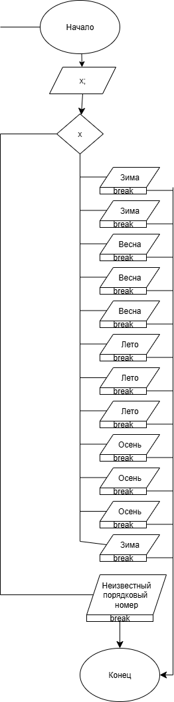

# Homework-lab7

### Условие задачи

5. составить программу, которая в зависимости от порядкового номера месяца выводит на экран время года.

### Алгоритм.
1. **Начало**
2. Задать исходные данные:
   - `x` - порядковый номер месяца.
3. Если `x` = `1` - вывести:
   `Зима`
   
   Если `x` = `2` - вывести:
   `Зима`
   
   Если `x` = `3` - вывести:
   `Весна`
   
   Если `x` = `4` - вывести:
   `Весна`
   
   Если `x` = `5` - вывести:
   `Весна`
   
   Если `x` = `6` - вывести:
   `Лето`
   
   Если `x` = `7` - вывести:
   `Лето`
   
   Если `x` = `8` - вывести:
   `Лето`
   
   Если `x` = `9` - вывести:
   `Осень`
   
   Если `x` = `10` - вывести:
   `Осень`
   
   Если `x` = `11` - вывести:
   `Осень`
   
   Если `x` = `12` - вывести:
   `Зима`
   
   Если `х` неизвестен - вывести:
   `Неизвестный номер месяца`
   
5. **Конец**

### Блок-схема
!
(https://app.diagrams.net/#HIvan-Gus%2FHomework-lab7%2Fmain%2FLaba7.png#%7B%22pageId%22%3A%22vKg7L8X21BIwSFlcxruJ%22%7D)

### 2. Реализация программы

    #include <stdio.h>
    #include <stdlib.h>
    #include <locale.h>
    #include <math.h>
    #define _USE_MATH_DEFINES 
    #define _CRT_SECURE_NO_DEPRECATE 

    int main() {

	setlocale(LC_CTYPE, "RUS");
  
	int x;
  
	puts("Введите номер месяца: ");
  
	scanf("%d", &x);
  
	switch (x) 
  
	{
  
		case 1:
    
			printf("Зима\n");
      
			break
      
		case 2:
			printf("Зима\n");
      
			break;
      
		case 3:
    
			printf("Весна\n");
      
			break;
      
		case 4:
    
			printf("Весна\n");
      
			break;
      
		case 5:
    
			printf("Весна\n");
      
			break;
      
		case 6:
    
			printf("Лето\n");
      
			break;
      
		case 7:
    
			printf("Лето\n");
      
			break;
      
		case 8:
    
			printf("Лето\n");
      
			break;
      
		case 9:
    
			printf("Осень\n");
      
			break;
      
		case 10:
    
			printf("Осень\n");
      
			break;
      
		case 11:
    
			printf("Осень\n");
      
			break;
      
		case 12:
    
			printf("Зима\n");
      
			break;
      
		default:
    
			printf("Неправильный номер месяца\n");

	}

	return 0;
    }

### 3. Результаты работы программы

    Введите номер месяца:
    
    5
    
    Весна

### 4. Информация о разработчике

Гусев Иван бИЦ-251
